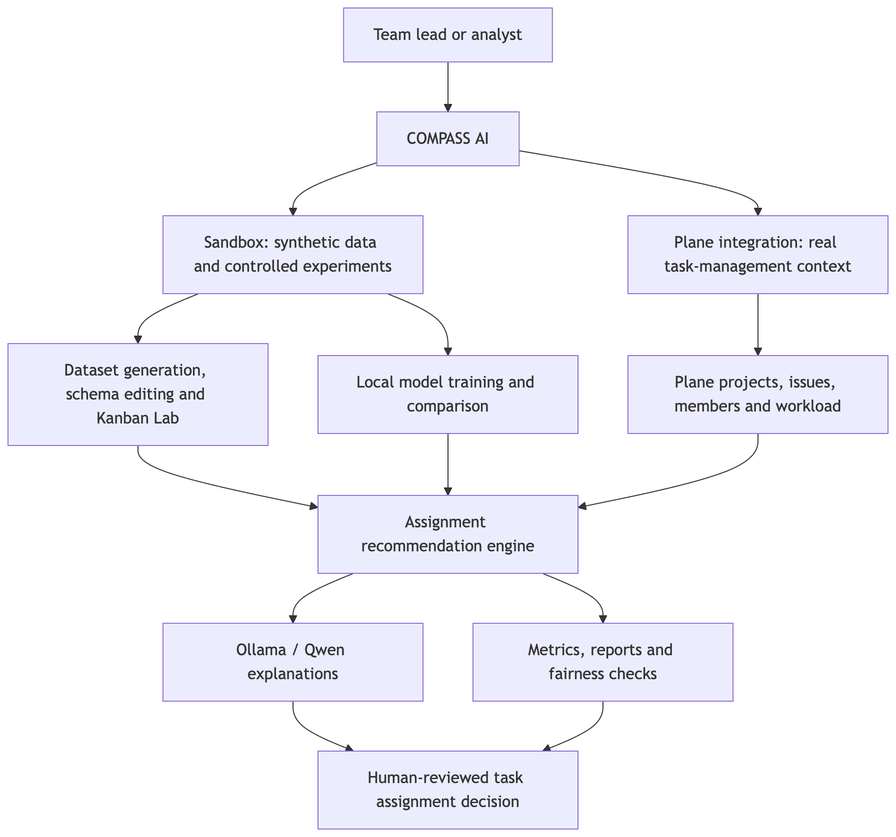
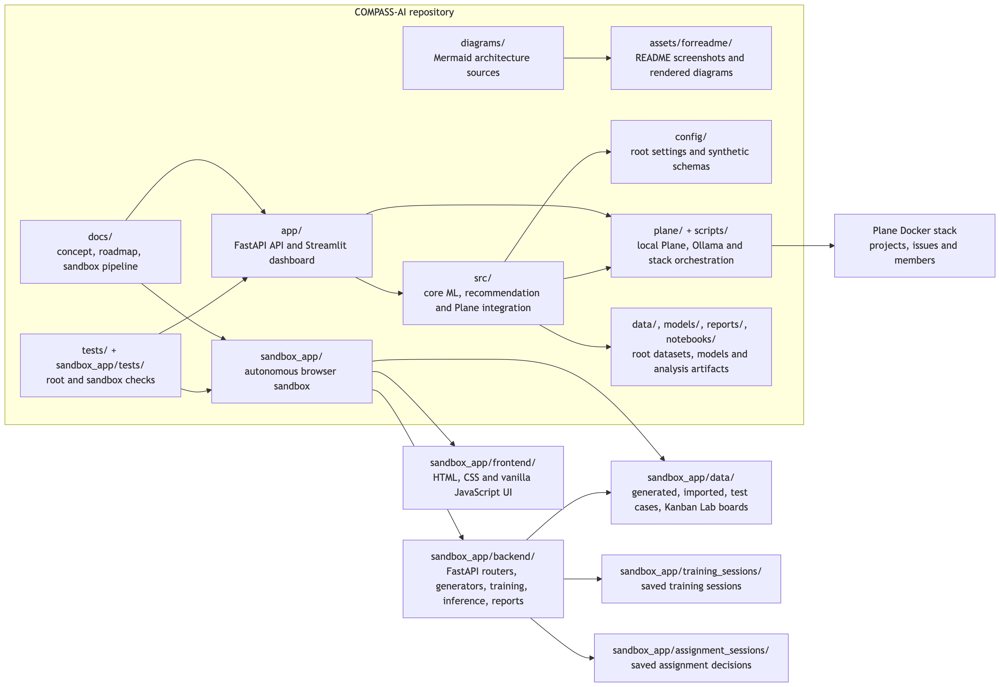
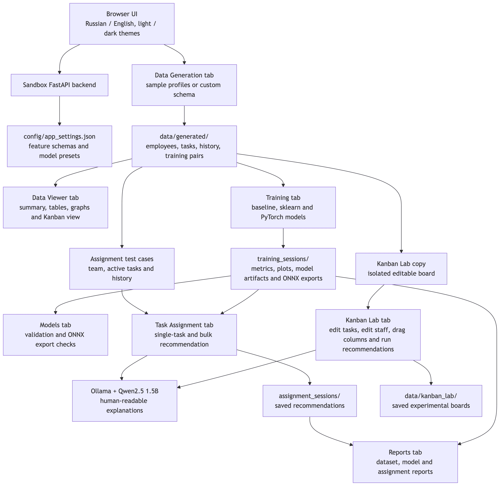
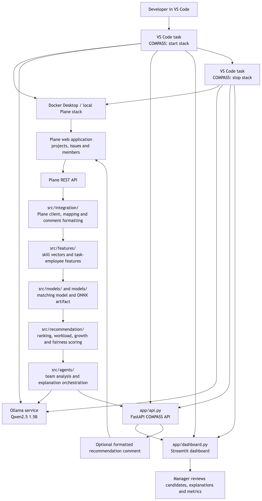

<div align="center">


# COMPASS AI

**Competency-Oriented Matching & Project Assignment Support System**

**Project assignment support by competencies**

[](https://github.com/TheAndreyZakharov/COMPASS-AI/blob/main/README_RU.md)
[](https://github.com/TheAndreyZakharov/COMPASS-AI/blob/main/README.md)

</div>

COMPASS AI is a local AI system for task assignment by employee competencies, workload, delivery risk and development goals.

The project contains two connected product layers:

- **COMPASS AI Sandbox** — an autonomous local browser application for synthetic data generation, dataset inspection, model training, recommendation testing, Kanban experiments, reports and model exports.
- **COMPASS AI + Plane** — an integration layer for working with a real open-source project management system, Plane, and for applying the same assignment logic to project tasks and team members.

The system is designed as a serious ML/AI prototype for studying task-to-employee matching, recommendation explainability, fairness risks, team workload and local AI workflows.

## Core idea

COMPASS AI helps a team lead decide who should receive a task.

The system analyzes:

- task type, priority, complexity and estimated effort;
- required skills and technology tags;
- project context and deadline pressure;
- employee role, grade and skills;
- current workload and fatigue;
- previous assignment history;
- quality, speed and deadline reliability;
- development goals and learning potential.

The output is a ranked list of candidates with numeric scores, risks, workload context and an explanation that can be generated by a local LLM.

## Main capabilities

COMPASS AI supports:

- configurable domain profiles for developers, designers or any custom domain;
- generation of employees, tasks, task history and training pairs;
- CSV, JSON and Parquet dataset storage;
- browser-based dataset viewer with tables, summaries, charts and Kanban views;
- training of several models on generated or imported data;
- model comparison, validation and optional ONNX export;
- single-task recommendation and bulk task distribution;
- local LLM explanations through Ollama and Qwen;
- assignment reports, model reports and dataset reports;
- Kanban Lab for isolated experiments on copied data;
- Plane integration for real project-management workflows;
- Streamlit dashboard for Plane, synthetic data and model metrics.

## AI and model layer

The original project direction is a `TaskEmployeeMatchingNet` neural matching model that predicts the probability of successful task assignment for a pair `task + employee`.

The sandbox also trains and compares several practical models:

- `baseline_rule_based`;
- `sgd_classifier`;
- `logistic_regression`;
- `random_forest`;
- `hist_gradient_boosting`;
- `torch_mlp`.

The local explanation layer uses Ollama. The configured model is:

```text
qwen2.5:1.5b-instruct
```

This model is used because it is compact, fast enough for local work, suitable for lightweight machines and produces acceptable Russian-language explanations.

## How it works

High-level processing flow:

```text
Dataset or Plane task
        ↓
Task and employee features
        ↓
Model scoring for task-employee pairs
        ↓
Candidate ranking
        ↓
Workload, risk and fairness checks
        ↓
Optional Qwen/Ollama explanation
        ↓
Recommendation, assignment session or report
```

## Local launch

### Sandbox launch

The sandbox is an autonomous local application inside `sandbox_app`.

Start:

```bash
bash sandbox_app/scripts/start.sh
```

Stop:

```bash
bash sandbox_app/scripts/stop.sh
```

The scripts start and stop the local services required by the sandbox, including the backend and Ollama flow where applicable.

Default sandbox URL:

```text
http://127.0.0.1:8601
```

Sandbox API documentation:

```text
http://127.0.0.1:8601/api/docs
```

### Plane stack launch

The Plane-integrated stack is launched through VS Code tasks.

Open the command palette:

```text
Cmd + Shift + P
```

Then run:

```text
Tasks: Run Task
COMPASS: start stack
```

Stop:

```text
Tasks: Run Task
COMPASS: stop stack
```

The start task launches Plane, Ollama, the COMPASS API and the dashboard. The stop task stops local processes and supporting applications used by the stack.

Default URLs:

```text
COMPASS API:       http://localhost:8000
COMPASS Dashboard: http://localhost:8501
Plane:             http://localhost
```

## COMPASS AI Sandbox

The sandbox is the main experimental environment. It can generate a complete synthetic dataset, train models, validate recommendations and run isolated Kanban experiments without changing the original dataset.

### Home screen

<div align="center">


</div>

The home screen contains the sidebar with the main sections and the backend status indicator. The top header contains language switching, theme switching, refresh, help and API buttons. The API button opens `/api/docs`. The main area shows the recommended workflow: create a dataset, train models and test assignments. It also shows system status, created datasets, models and other runtime counters.

### Theme, language and refresh

<div align="center">


</div>

The interface supports Russian and English language modes, light and dark themes, and a refresh action that reloads page data without leaving the current section.

### Notifications and progress

<div align="center">


</div>

Short notifications and long-running process notifications are shown in the lower-right corner. Dataset generation, model training and other long operations use persistent progress notifications with a progress bar and status text.

### Context help

<div align="center">


</div>

The header information button opens contextual help for the current screen. It explains the purpose of the section and the expected user actions.

### Data generation

<div align="center">


</div>

The data generation section can create example developer and designer datasets. The important mode is the custom domain profile: the user can adapt roles, grades, skills, task types and custom fields to a specific company or project. Dataset size presets include small preview, medium validation, large training and huge training. The preset controls the number of employees, tasks, history rows and training pairs, but the user can override the values manually. A seed can be provided for reproducible generation.

### Custom developer preset

<div align="center">


</div>

This example shows a custom preset for a large developer team. The same preset is described in `docs/sandbox27.md`. A custom preset can be saved, edited and reused. A full dataset is created with the `Create full dataset` action, while separate actions can generate only employees, tasks or history.

### Data viewer

<div align="center">


</div>

The data viewer shows all generated and imported datasets. A selected dataset can be inspected by table type: employees, tasks, assignment history and training pairs. The same section also allows dataset deletion.

### Dataset summary and tables

<table>
  <tr>
    <td align="center"><strong>Dataset summary</strong><br/></td>
    <td align="center"><strong>Employees table</strong><br/></td>
  </tr>
  <tr>
    <td align="center"><strong>Tasks table</strong><br/></td>
    <td align="center"><strong>Assignment history</strong><br/></td>
  </tr>
</table>

The summary view gives the general dataset picture. Table views allow direct inspection of employees, tasks and task execution history.

<div align="center">


</div>

Training pairs show task-candidate combinations used for model training.

### Graphs and Kanban in Data Viewer

<div align="center">


</div>

The chart view helps inspect employee and task distributions.

<div align="center">


</div>

The Kanban view groups tasks by status and shows task-level summary information.

### Data import

<div align="center">


</div>

The import section can load external data in supported formats. Imported datasets are kept separately from generated datasets and can be used in later workflow stages.

### Model training

<div align="center">


</div>

The training section selects a dataset, training-pair limits, split ratios and model parameters. The user can train all six available models or choose a subset. The training process creates a session with artifacts, metrics and reports.

### Training session results

<div align="center">


</div>

After training, the session can be selected, inspected and deleted. The interface shows session metadata, model metrics and model comparison.

### Training plots

<div align="center">


</div>

Generated plots include a model comparison chart and per-model diagnostic plots.

<div align="center">


</div>

Plots can be reviewed at any time as long as the training session exists.

### Models

<div align="center">


</div>

The models section shows training-session details, validates saved models and can export supported models to ONNX.

### Assignment Lab

<div align="center">


</div>

The assignment section creates a test set from a dataset, selects a training session and model, configures recommendation modes and optionally enables LLM explanations. It can recommend candidates for one task or distribute all eligible tasks across the team while considering competencies, workload and risk.

### Single-task recommendation overview

<div align="center">


</div>

The recommendation result begins with task requirements, then shows the top candidates, candidate metrics, numeric comparison, LLM explanation and a fit chart comparing task requirements with candidate capabilities.

### Recommendation details

<div align="center">


</div>

The first detail block shows the task requirements and the highest-ranked candidates.

<div align="center">


</div>

The comparison section shows candidate properties, scores and differences.

<div align="center">


</div>

The explanation section presents a structured LLM answer and a chart that compares required task properties with candidate strengths.

## Kanban Lab

Kanban Lab is an isolated experimental workspace. It works with a copy of the dataset or test set. The original generated dataset is not modified. The user can remove tasks, add manual tasks, edit the team, save modified boards and calculate recommendations for the current board state.

### Lab source and saved boards

<div align="center">


</div>

The user selects a dataset, test set, training session, model, candidate count and LLM explanation mode. A new lab copy can be loaded from a dataset, or a previously saved modified board can be loaded. Current changes can be saved as a separate lab board. Saved boards are stored separately in `sandbox_app/data/kanban_lab`.

### Manual task creation

<div align="center">


</div>

Manual task creation uses existing task types, projects and skills from the current dataset. This prevents invalid tags and keeps the task understandable for the trained models.

### Manual team editing

<div align="center">


</div>

The team can also be edited inside the lab copy. The user can add a new employee with a role, grade, workload, availability, speed, quality and skills, or remove selected employees. These changes affect only the lab copy.

### Kanban board operations

<div align="center">


</div>

The Kanban board contains the copied tasks. Individual cards can be dragged between columns. Entire columns can be moved to another status or cleared. Each card shows task identifiers, priority, effort and required skills.

### Recommendations on Kanban cards

<div align="center">


</div>

After applying the Kanban state and calculating recommendations, each task card can show the top candidates for that task.

### Kanban recommendation details

<div align="center">


</div>

The detailed panel shows requirements, candidates, numeric comparison, LLM explanation and the fit chart for the selected Kanban task.

<div align="center">


</div>

This view focuses on task requirements, matched skills and missing skills.

<div align="center">


</div>

The LLM section explains candidate suitability in natural language and the chart visualizes the match.

<div align="center">


</div>

Kanban Lab is intended for practical experimentation with current tasks, staffing assumptions and model behavior.

### Reports

<div align="center">


</div>

The reports section generates reports for datasets, trained models and assignment sessions. Reports can be opened and deleted from the interface.

<div align="center">


</div>

Report summaries provide a compact overview of generated artifacts and results.

### Settings

<div align="center">


</div>

Settings include default values, seeds, timeouts, LLM parameters, storage paths, schemas and domain profiles.

## Plane integration and dashboard

Plane is used because it is open source and provides a practical project-management environment for issues, projects, members and task workflows. The integration can be adapted to another HRM or project-management system if a different organization needs another source of truth.

### Plane main screen

<div align="center">


</div>

Plane stores projects, issues, members and workflow context.

### COMPASS AI dashboard

<div align="center">


</div>

The COMPASS AI dashboard connects synthetic data, model metrics, Plane tasks and recommendation workflows.

### Overview

<div align="center">


</div>

The overview page shows synthetic-data statistics, assignment quality and the current base state of the system.

### Issue recommendations

<div align="center">


</div>

The recommendation page allows the user to select the number of candidates, enable LLM explanations, enter an existing task identifier or create a task directly from the dashboard.

<div align="center">


</div>

The AI ranks candidate assignees by score and displays the recommendation result.

<div align="center">


</div>

The LLM explanation describes why the candidates are suitable and what risks should be considered.

### Plane Live

<div align="center">


</div>

Plane Live displays information about the active Plane workspace and connected project data.

### Team workload

<div align="center">


</div>

The workload page shows employee load and helps identify overload risks.

### Plane team

<div align="center">


</div>

The Plane team page shows project members and team participation in Plane projects.

### Model metrics

<div align="center">


</div>

The model metrics page presents training and ranking metrics for the model used by the Plane workflow.

### Fairness

<div align="center">


</div>

The fairness page checks assignment distribution, concentration and fairness risks.

### Dashboard settings

<div align="center">


</div>

The settings page configures dashboard options, API connection and local service parameters.

## Data and artifact storage

The sandbox stores runtime data in isolated directories:

```text
sandbox_app/data/generated/       generated datasets
sandbox_app/data/imported/        imported datasets
sandbox_app/data/test_cases/      test cases for assignment checks
sandbox_app/data/kanban_lab/      saved Kanban Lab boards
sandbox_app/training_sessions/    trained model sessions
sandbox_app/assignment_sessions/  saved assignment sessions
sandbox_app/reports/              generated reports
sandbox_app/data/exports/         exported report bundles and model artifacts
```

The main project stores synthetic data, models and reports in the root-level `data`, `models`, `reports` and `notebooks` directories.

## Technical stack

Backend and ML:

- Python 3.11;
- FastAPI;
- Pydantic;
- Pandas;
- NumPy;
- scikit-learn;
- PyTorch;
- ONNX and ONNX Runtime;
- PyArrow / Parquet;
- Matplotlib and Plotly;
- Jupyter notebooks.

Frontend and dashboards:

- HTML;
- CSS;
- Vanilla JavaScript;
- Streamlit;
- browser-based local UI;
- FastAPI static frontend serving.

Integrations and local services:

- Plane;
- Plane REST API;
- Docker-based local Plane stack;
- Ollama;
- Qwen2.5 1.5B Instruct;
- VS Code tasks for stack orchestration.

## Verified environment

The project was developed and checked on:

```text
MacBook Air
Apple Silicon M2
8 GB RAM
macOS
Python 3.11
Local Ollama runtime
Local Plane stack
```

This is intentionally not a high-end workstation. The sandbox workflow, model training with controlled limits, local API and dashboard were tested on a lightweight laptop. On a more powerful desktop machine or on a dedicated local server, the same system should have more comfortable performance headroom for larger datasets, heavier training sessions, more concurrent users and longer-running experiments.

For memory-limited machines, training can be restricted by limiting the number of training pairs. The documented sandbox workflow uses this approach to keep the system usable while the browser, editor and local services remain open.

## Architecture diagrams

The diagram sources are stored in `diagrams/` as Mermaid files. The README references PNG files in `assets/forreadme/`.

### Simple overview

<p align="center">
  
</p>

Source: `diagrams/compass_overview.mmd`.

### Detailed repository architecture

<p align="center">
  
</p>

Source: `diagrams/repository_architecture.mmd`.

### Sandbox pipeline

<p align="center">
  
</p>

Source: `diagrams/sandbox_pipeline.mmd`.

### Plane integration pipeline

<p align="center">
  
</p>

Source: `diagrams/plane_integration.mmd`.

## Project structure

The repository is a single project. The root application, Plane integration and autonomous sandbox live in the same repository but remain separated by folders and runtime data boundaries.

```text
COMPASS-AI/
├── .env.example                       Environment variable template
├── .vscode/
│   ├── settings.json                  Local editor settings
│   └── tasks.json                     VS Code tasks for COMPASS stack control
├── commands.txt                       Short local command reference
├── docker-compose.compass.yml         Root Docker Compose integration file
├── Makefile                           Root maintenance and helper commands
├── pyproject.toml                     Python tooling configuration
├── requirements.txt                   Root runtime dependencies
├── requirements-dev.txt               Root development dependencies
├── app/
│   ├── api.py                         FastAPI entrypoint for the main COMPASS API
│   └── dashboard.py                   Streamlit dashboard for Plane and analytics
├── assets/
│   └── forreadme/                     README screenshots and logo assets
├── config/
│   ├── paths.yaml                     Root project path configuration
│   ├── settings.yaml                  Root project settings
│   ├── synthetic_data.yaml            Synthetic data generation settings
│   └── synthetic_schema.yaml          Synthetic schema configuration
├── data/
│   ├── raw/                           Raw and external input data
│   ├── processed/                     Prepared data and Plane mappings
│   └── synthetic/                     Synthetic employees, tasks and assignments
├── docs/
│   ├── doc.md                         Project concept and architecture
│   ├── plan.md                        Additional planning notes
│   ├── synthetic_data_design.md       Synthetic data design notes
│   ├── todo.md                        Full development roadmap
│   ├── todo_subproj_27.md             Sandbox implementation record
│   └── sandbox27.md                   Manual sandbox pipeline
├── diagrams/
│   ├── compass_overview.mmd           Simple high-level architecture diagram
│   ├── repository_architecture.mmd    Detailed repository architecture diagram
│   ├── sandbox_pipeline.mmd           Sandbox data, training and assignment flow
│   └── plane_integration.mmd          Plane integration and live recommendation flow
├── logs/                              Runtime logs for local services
├── models/
│   ├── compass_matching_model.pt      PyTorch matching model artifact
│   └── task_employee_matcher.onnx     ONNX export artifact
├── notebooks/
│   ├── 01_synthetic_data_generation.ipynb
│   ├── 02_data_analysis.ipynb
│   ├── 03_model_training.ipynb
│   ├── 04_model_evaluation.ipynb
│   ├── 05_fairness_analysis.ipynb
│   ├── 06_plane_integration_demo.ipynb
│   └── 07_business_report.ipynb
├── plane/
│   ├── docker/                        Local Plane source and Docker setup
│   └── seed/                          Plane seed and helper data
├── reports/                           Root model metrics, fairness and notebooks
├── scripts/
│   ├── start_compass_stack.sh         Start main API, dashboard, Plane and Ollama flow
│   ├── stop_compass_stack.sh          Stop the main local stack
│   ├── start_plane.sh                 Start local Plane
│   ├── stop_plane.sh                  Stop local Plane
│   ├── start_ollama.sh                Start Ollama helper
│   └── stop_ollama.sh                 Stop Ollama helper
├── src/
│   ├── __init__.py                    Root Python package marker
│   ├── agents/                        Agentic task, team, matching and explanation logic
│   ├── api/                           API routers for Plane and recommendations
│   ├── data/                          Synthetic data generation and splits
│   ├── features/                      Feature engineering and skill vectorization
│   ├── integration/                   Plane client, mapping and comment formatting
│   ├── llm/                           Ollama client integration
│   ├── models/                        Matching model, training, inference and ONNX export
│   ├── recommendation/                Rule-based ranking, workload and growth scoring
│   ├── reports/                       Notebook and report generation
│   └── utils/                         Shared utilities
├── tests/                             Root project tests
├── sandbox_app/
│   ├── .python-version                Sandbox Python version pin
│   ├── README.md                      Sandbox-specific README
│   ├── requirements.txt               Sandbox runtime dependencies
│   ├── assets/                        Sandbox logo and local assets
│   ├── backend/
│   │   ├── main.py                    Sandbox FastAPI application entrypoint
│   │   ├── api/                       Sandbox API routers
│   │   ├── core/                      Settings, paths, time and contracts
│   │   ├── data_generation/           Employees, tasks, history and training pairs
│   │   ├── features/                  Sandbox feature builders and targets
│   │   ├── inference/                 Recommendations, assignment optimization and ONNX runtime
│   │   ├── llm/                       Qwen/Ollama explanations
│   │   ├── reports/                   Dataset, model and assignment reports
│   │   ├── training/                  Baseline, sklearn and PyTorch training
│   │   └── utils/                     Importers, JSON helpers and validation
│   ├── config/
│   │   ├── app_settings.json          Sandbox settings and limits
│   │   ├── model_presets.json         Available model presets
│   │   ├── data_contracts/            Data contract definitions
│   │   └── feature_schemas/           Developers, designers and custom schemas
│   ├── data/
│   │   ├── generated/                 Generated datasets
│   │   ├── imported/                  Imported datasets
│   │   ├── test_cases/                Assignment test cases
│   │   ├── kanban_lab/                Saved Kanban Lab boards
│   │   └── exports/                   Exported bundles and model artifacts
│   ├── docs/                          Sandbox-specific documentation
│   ├── frontend/
│   │   ├── index.html                 Sandbox browser shell
│   │   ├── css/                       Sandbox styles
│   │   └── js/
│   │       ├── app.js                 Sandbox frontend bootstrap and router
│   │       ├── api.js                 Browser API client
│   │       ├── components/            Shared frontend components
│   │       └── pages/                 Sandbox UI tabs and workflows
│   ├── logs/                          Sandbox runtime logs
│   ├── reports/                       Generated sandbox reports
│   ├── scripts/                       Sandbox start, stop, restart and smoke scripts
│   ├── tests/                         Sandbox tests
│   ├── training_sessions/             Saved training sessions
│   └── assignment_sessions/           Saved assignment sessions
├── README.md
└── README_RU.md
```

## Project purpose

COMPASS AI was intentionally built at the intersection of software engineering, team management and AI-assisted decision support. The project is not limited to a generic machine learning demonstration: it models a practical management problem that appears in development teams every day.

The central question is not only which employee has the required skill. A useful assignment system must also consider workload, fatigue, deadline reliability, task complexity, quality history, risks and the long-term development of the employee. This makes the project relevant both for engineering managers and for developers who want to understand how AI recommendations can be grounded in transparent data.

The Plane integration represents the operational side of the system: tasks, projects and members can come from a real project-management tool. The sandbox represents the research and experimentation side: the user can generate data, change schemas, train models, inspect metrics, run Kanban experiments and test explanations without touching real production data.

This design makes COMPASS AI suitable for studying ML-based ranking, AI explainability, local LLM usage, team analytics, fairness risks and reproducible decision-support workflows in software development and project management.

## Notes

COMPASS AI is a local research and educational project. It is designed to make task assignment logic inspectable: datasets are visible, models are comparable, recommendations are explainable and experiments can be reproduced.

The sandbox is intentionally separated from the main Plane-integrated application. This makes it possible to run heavy experiments, generate synthetic data and test Kanban scenarios without changing the main COMPASS API or Plane data.
