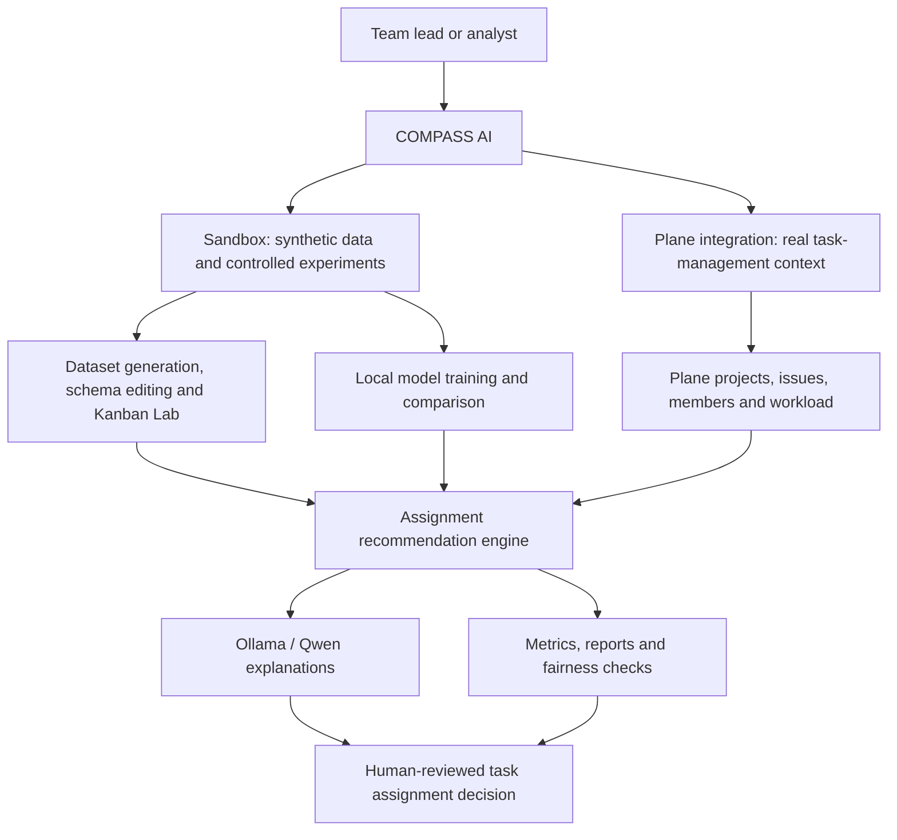
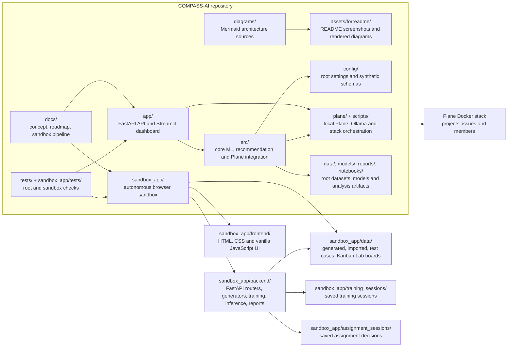
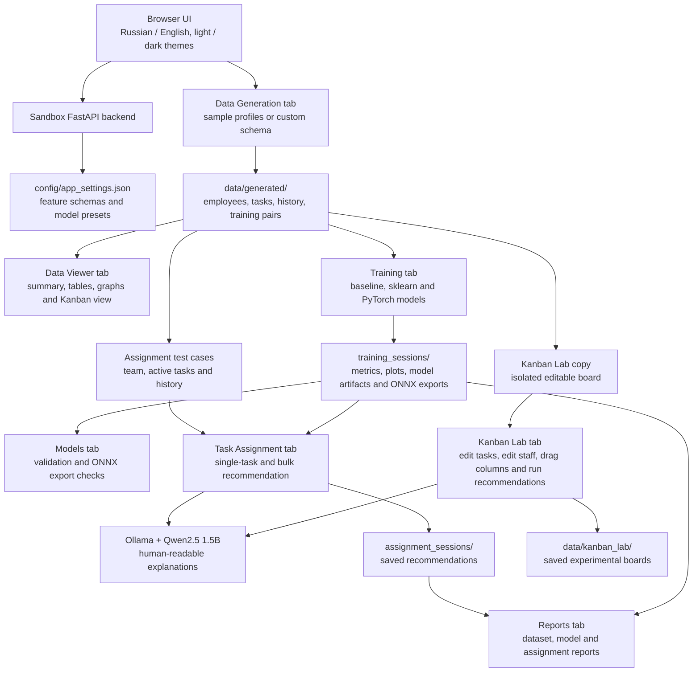
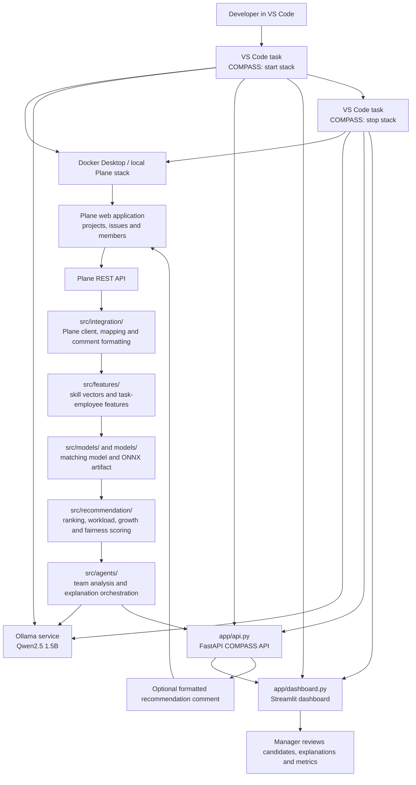
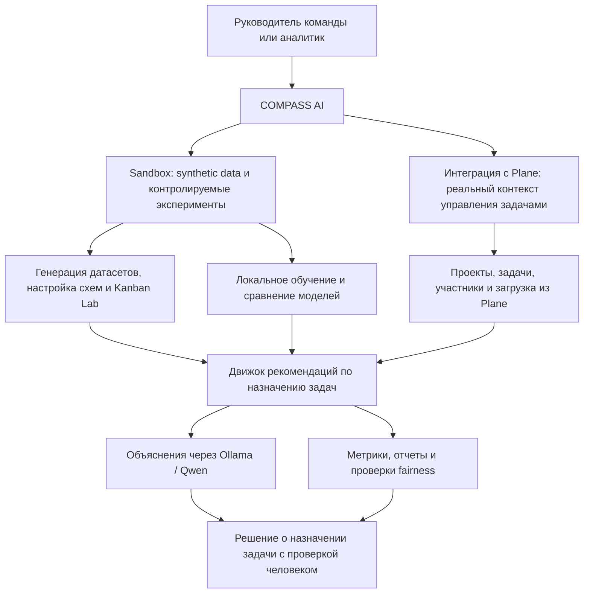
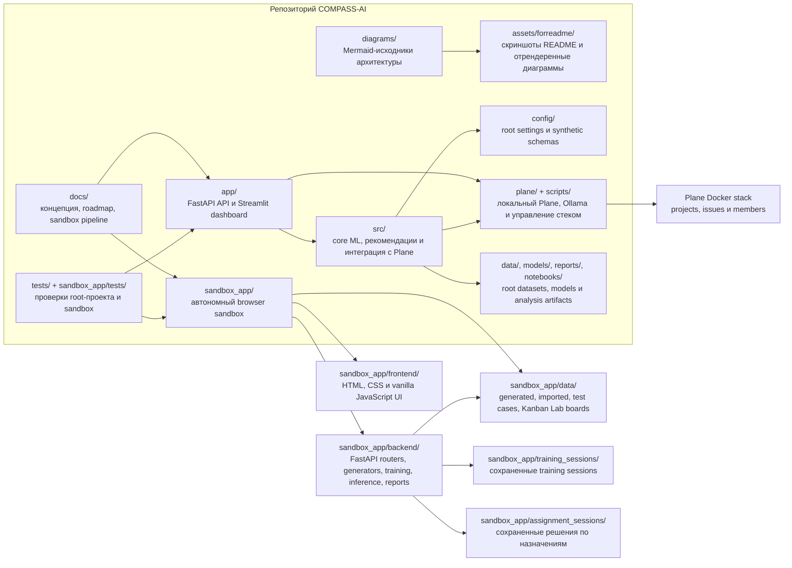
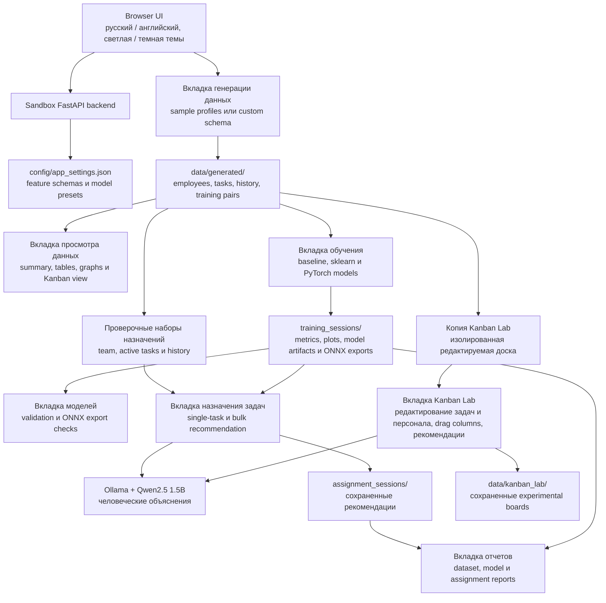
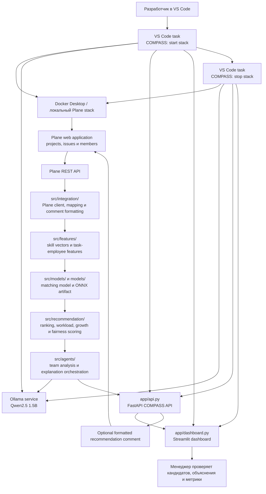

# COMPASS AI Diagrams

This file previews the Mermaid diagrams stored in this directory. GitHub renders these `mermaid` blocks directly in Markdown.

## English Diagrams

### COMPASS Overview

Source: [compass_overview.mmd](compass_overview.mmd)

### Repository Architecture

Source: [repository_architecture.mmd](repository_architecture.mmd)

### Sandbox Pipeline

Source: [sandbox_pipeline.mmd](sandbox_pipeline.mmd)

### Plane Integration Pipeline

Source: [plane_integration.mmd](plane_integration.mmd)

## Russian Diagrams

### COMPASS Overview RU

Source: [compass_overview_RU.mmd](compass_overview_RU.mmd)

### Repository Architecture RU

Source: [repository_architecture_RU.mmd](repository_architecture_RU.mmd)

### Sandbox Pipeline RU

Source: [sandbox_pipeline_RU.mmd](sandbox_pipeline_RU.mmd)

### Plane Integration Pipeline RU

Source: [plane_integration_RU.mmd](plane_integration_RU.mmd)

